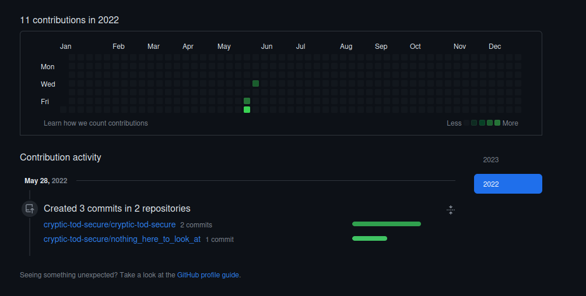
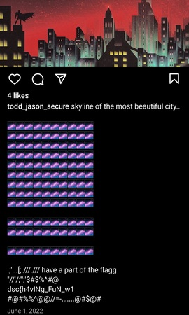
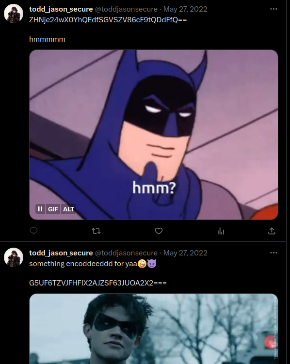

## DeconstruCTF 2023 - Missing
### Description
**Jason todd went missing and all alfred was able to recover from his pc was this file
Help Alfred find Jason   
Author: Rakhul   
Flag Format: dsc{[a-zA-Z0-9_]+}   
Challenge Type: OSINT challenge**

### Walkthrough
There is an attachment to the file that Alfred has recovered, namely **jason.rar**. The file is compressed using the rar extension format. 
When I tried to extract it using the unrar package in Linux, it asked for a password to extract the contents.   

Therefore, I used RAR password recovery while browsing the internet. The link can be accessed [here](https://www.lostmypass.com/file-types/rar/). 

When I got the password, I extracted it again using the unrar command:
`unrar x jason.rar`

It consists of two folders: cryptic-tod-secure and nothing_here_to_look_at.

After that, I searched through the folders and read empty.txt from the nothing_here_to_look_at folder. I found an interesting clue in this file. It says,
`find my github pages site that i accidentaly deleted to find what u want :P`

Then, I used ls -al command to search the hidden folder and file. It shows me the hidden folder is the .git folder. This means that all these folders and files are hosted on Github. To know what the link to the github pages is, I read through the config file inside the git folder. In there, we can see the github link is `https://github.com/cryptic-tod-secure/nothing_here_to_look_at.git`.

In this state, we need to find out what pages Jason deleted. Every change in Github pages is recorded under the contribution activity in the root folder.
The root folder can be accessed [here](https://github.com/cryptic-tod-secure?tab=overview&from=2022-12-01&to=2022-12-31) , you can manually backtrack the folder and see the contribution activity in 2022.

Then click the commit text beside the **nothing_here_to_look_at** folder. By reading the update of empty.txt, we get the encoded text (`aHR0cHM6Ly93d3cuaW5zdGFncmFtLmNvbS90b2RkX2phc29uX3NlY3VyZS8=`) that has been deleted previously.

I used [CyberChef](https://gchq.github.io/CyberChef/) to decode the text. The encoded text uses base64. The decoded text is an Instagram link that can be used to get another clue.  
Searching again through his Instagram account, we will find the partial flag. To get the rest of the flag, there is a clue on the first post. The comment that has been posted by Jason shows the next step. 

  

We need to go to Jason's Twitter account. Hence, I tried to use the same username on Twitter, and I found his account.

 

There are two posts with encoded text. The first encoded text can be decoded using base64. But It is a rabbit hole.
Then, it must be the second post that has the flag. I did guess the encoded text, and I found out that it is base32 encoded text.
Finally, the rest of the flag was obtainned.

 Flag 
 dsc{h4vINg_FuN_w17h_O5INT_@Nd_m4p5} 

